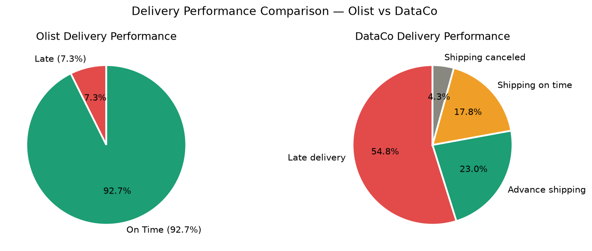
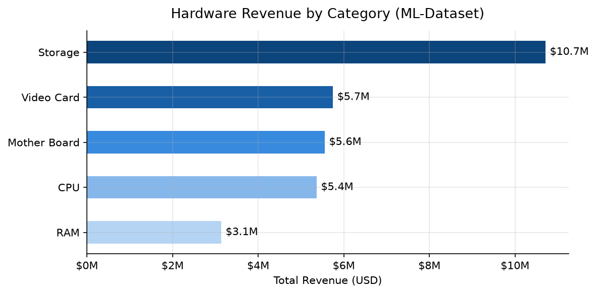
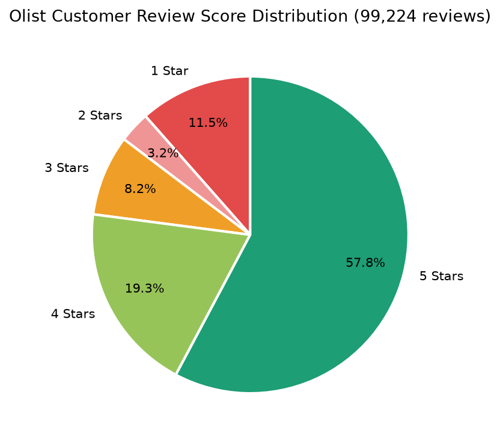

# RetailPulse — Supply Chain & Retail Analytics


## Project Overview

End-to-end supply chain analytics project analysing **294,344 order records** across 3 real-world datasets totalling **$80.9M in revenue**. Built a complete analytics pipeline — from raw data ingestion and ETL to star schema design, SQL analysis, and a 4-page Tableau dashboard covering four different stakeholder personas.

---

## Live Dashboard

🔗 **Tableau Public:** [View Interactive Dashboard — RetailPulse Supply Chain Analytics](https://public.tableau.com/app/profile/samiya.imran/viz/RetailPulse_Dashboard/Dashboard1)

---

## Key Findings

| Finding | Value |
|---|---|
| DataCo Late Delivery Rate | **54.8%** vs Olist **7.3%** — massive operational gap |
| Root Cause | First Class promises 1 day but takes 2–3 days → **95.3% late rate** |
| Total Revenue | **$80.9M** across all 3 datasets combined |
| Top Revenue Category | Storage drives **35%** of hardware revenue |
| Storage Profit Margin | Only **0.55%** — lowest of all hardware categories |
| Best Profit Margin | RAM at **3.52%** — highest margin category |
| Olist Customer Reviews | **77%** positive · **14.7%** negative · **11,424** one-star reviews |
| Olist Avg Delivery | **11.3 days early** on average vs estimated date |
| DataCo Avg Delay | **+0.6 days** over promised delivery date |
| Credit Card Usage | **74%** of Olist payments · avg **3.5 installments** · max 24 months |
| Foreign Keys Enforced | **6** relationships across star schema |
| Business KPIs Tracked | **12** across all stakeholder dashboards |

---

## Exploratory Data Analysis

### Late Delivery Rate Comparison

*DataCo 54.8% late rate vs Olist 7.3% — diagnosed root cause: First Class shipping mode has 95.3% late rate*

### Revenue by Category

*Storage dominates hardware revenue at $10.7M (35%) but has the lowest profit margin*

### Review Score Distribution

*57,328 five-star reviews vs 11,424 one-star reviews — polarised customer satisfaction*

---

## Tableau Dashboards

### Dashboard 1 — Executive KPI Dashboard
**Stakeholder: VP of Supply Chain**


### Dashboard 2 — Delivery Performance
**Stakeholder: Procurement Team**


### Dashboard 3 — Product & Warehouse Analysis
**Stakeholder: Warehouse Operations Manager**


### Dashboard 4 — Customer & Payment Insights
**Stakeholder: Finance Team**


---

## Database Schema

Star schema with **5 dimension tables** and **4 fact tables** — **6 foreign key relationships** enforced in SQL Server.

```
dim_warehouse ◄──┐
dim_product   ◄──┤
dim_customer  ◄──┼── fact_orders   (294,344 rows — central fact table)
dim_employee  ◄──┤
dim_seller    ◄──┘

fact_delivery  (279,960 rows — delivery timing and late flags)
fact_reviews   ( 98,410 rows — customer satisfaction and sentiment)
fact_payments  (103,886 rows — payment method and installments)
```

---

## Tools & Technologies

| Layer | Tools |
|---|---|
| Data Cleaning & ETL | Python · Pandas · NumPy |
| Exploratory Analysis | Matplotlib |
| Database | SQL Server · T-SQL |
| SQL Features | Window Functions · CTEs · Stored Procedures · Indexing · Foreign Keys |
| Visualisation | Tableau Public |
| Schema Design | Star Schema — 5 dimension + 4 fact tables |

---

## Datasets

| Dataset | Rows | Size | Source |
|---|---|---|---|
| ML-Dataset | 400 | ~50 KB | Included in repo |
| DataCo Supply Chain | 180,519 | 72 MB | Included in repo |
| Olist Orders | 99,441 | ~7 MB | Included in repo |
| Olist Order Items | 112,650 | ~9 MB | Included in repo |
| Olist Customers | 99,441 | ~6 MB | Included in repo |
| Olist Reviews | 99,224 | ~15 MB | Included in repo |
| Olist Payments | 103,886 | ~6 MB | Included in repo |
| Olist Products | 32,951 | ~2 MB | Included in repo |
| Olist Sellers | 3,095 | ~200 KB | Included in repo |
| Olist Geolocation | 1,000,163 | 80 MB |Included in repo |

---

## How to Run

1. Clone this repo
2. Run `notebooks/RetailPulse_Analysis.ipynb` top to bottom
3. Clean tables auto-save to `data/clean/`
4. Load into SQL Server using `sql/RetailPulse_SQL.sql`
5. Open `tableau/RetailPulse_Dashboard.twbx` in Tableau

---

## Project Structure

```
notebooks/          — Jupyter notebook (ETL + EDA + KPI analysis + SQL showcase)
notebooks/charts/   — Saved Matplotlib EDA charts
sql/                — SQL Server schema · 19 analysis queries · 6 Tableau views
tableau/            — Tableau packaged workbook (.twbx)
tableau/screenshots/— Dashboard screenshots (all 4 pages)
data/raw/           — Source CSV files (11 included)
```

---

## Author

**Samiya Imran** — Data Analyst  
📧 imransamiya817@gmail.com  
🔗 [LinkedIn](https://www.linkedin.com/in/samiya-imrann/)  
💻 [GitHub](https://github.com/imransamiya817-debug)
